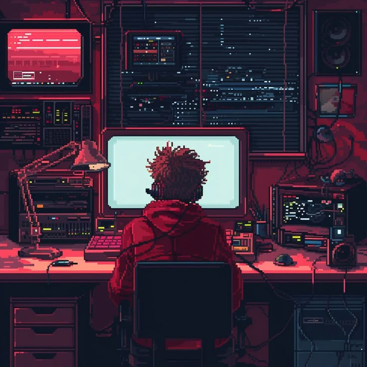

<div align="center">



<br/>


<br/>


<br/>

[](https://tryhackme.com/)
[](https://linkedin.com/in/ashish-goyal-a733a62b1)
[](mailto:goyalashish367@gmail.com)

</div>

---

##  About Me

```bash
┌──(ashish㉿kali)-[~/profile]
└─$ whoami

> Cybersecurity Student & Ethical Hacking Practitioner

┌──(ashish㉿kali)-[~/profile]
└─$ cat domains.txt

  [+] Penetration Testing
  [+] Web Exploitation
  [+] Digital Forensics
  [+] Linux & Networking
  [+] Malware Analysis
  [+] CTF Challenges

┌──(ashish㉿kali)-[~/profile]
└─$ cat achievements.log

  🏆 Top 7% Globally on TryHackMe
  🥈 2nd Rank — SurgeCTF by Craw Security (University Level)
  💻 Active CTF & Security Lab Practitioner

┌──(ashish㉿kali)-[~/profile]
└─$ echo $MOTTO

  "Passionate about offensive security, problem solving,
   and understanding how systems can be attacked & secured."
```

---

##  Tech Arsenal

<div align="center">

### Languages & Scripting


### Security & Offensive Tools


### Platforms & Frameworks


</div>

---

##  Featured Project

<div align="center">

<a href="https://github.com/goyalashish367-cpu/hercules">
  
</a>

</div>

> **Hercules** — Autonomous penetration testing & CTF solving platform powered by AI agents (CrewAI). Built for real-world offensive security workflows.

---

##  GitHub Activity

<div align="center">


<br/>


</div>

---

##  Connect

<div align="center">

```bash
┌──(ashish㉿kali)-[~]
└─$ nc -zv ashish-goyal 443

Connection established. Let's talk security.
```

[](https://linkedin.com/in/ashish-goyal-a733a62b1)
[](mailto:goyalashish367@gmail.com)
[](https://tryhackme.com/)

</div>

---

<div align="center">


</div>
